<picture>
  <source media="(prefers-color-scheme: dark)" srcset="./assets/signal-path-dark.svg">
  <source media="(prefers-color-scheme: light)" srcset="./assets/signal-path-light.svg">
  
</picture>

  <a href="https://tourist03.github.io/portfolio/">Portfolio</a>
  &nbsp;·&nbsp;
  <a href="https://www.linkedin.com/in/vineetsingh02/">LinkedIn</a>
  &nbsp;·&nbsp;
  <a href="mailto:singhvineet2001@gmail.com">Email</a>
  &nbsp;·&nbsp;
  <a href="https://leetcode.com/u/vineet-ii/">LeetCode</a>
  &nbsp;·&nbsp;
  <a href="https://www.codechef.com/users/vineet_03">CodeChef</a>

I am a systems-minded software engineer who builds across abstraction layers — from native runtimes and backend services to full-stack applied AI products.

I like problems that refuse to stay in one box: a crash that crosses a runtime boundary, a slow service that needs a better data path, or a noisy stream of articles that should become one useful story.

## What I work on

- **`01 / SYSTEMS + PLATFORM`** — C++, Linux, Tizen, runtime debugging, memory behavior, crash analysis, and software that has to respect real device constraints.
- **`02 / BACKEND SYSTEMS`** — Java, Spring Boot, REST APIs, Redis, MongoDB, asynchronous workflows, and services designed for reliability under load.
- **`03 / APPLIED AI`** — Python, FastAPI, Hugging Face models, embeddings, vector similarity, and React interfaces that turn model output into usable products.

## Selected work

### [OpenWave](https://github.com/tourist03/OpenWave) · applied AI news intelligence · `active build`

Building a full-stack news pipeline that crawls configurable sources, summarizes articles locally, creates semantic embeddings, and groups duplicate reports of the same event.

`React` `FastAPI` `BART` `MiniLM` `Vector Embeddings`

### [ScribeSpace](https://github.com/tourist03/Scribe-Script) · full-stack notes

A cloud-backed note-taking application with JWT authentication, MongoDB persistence, and a React interface for organizing personal notes.

[Live app](https://scribe-script.vercel.app/) · `React` `Node.js` `Express` `MongoDB`

### [100-Day SDE2 Roadmap](https://github.com/tourist03/Roadmap) · learning system

An interactive DSA and system-design roadmap with calendar-based progression, local streak tracking, filters, search, and milestone feedback.

[Live demo](https://tourist03.github.io/Roadmap/) · `React` `Vite` `GitHub Pages`

## Current coordinates

- Going deeper on runtime reliability, memory behavior, and cross-layer debugging.
- Building applied AI products with local inference, embeddings, and vector search.
- Keeping algorithmic problem-solving sharp: [LeetCode peak 1820](https://leetcode.com/u/vineet-ii/) · [CodeChef 1883 / 4★](https://www.codechef.com/users/vineet_03).

## Toolbox

`C++` · `Linux` · `Tizen` · `Java` · `Spring Boot` · `Python` · `FastAPI` · `JavaScript` · `React` · `Redis` · `MongoDB` · `Docker`

Keep the signal. Lose the noise.

